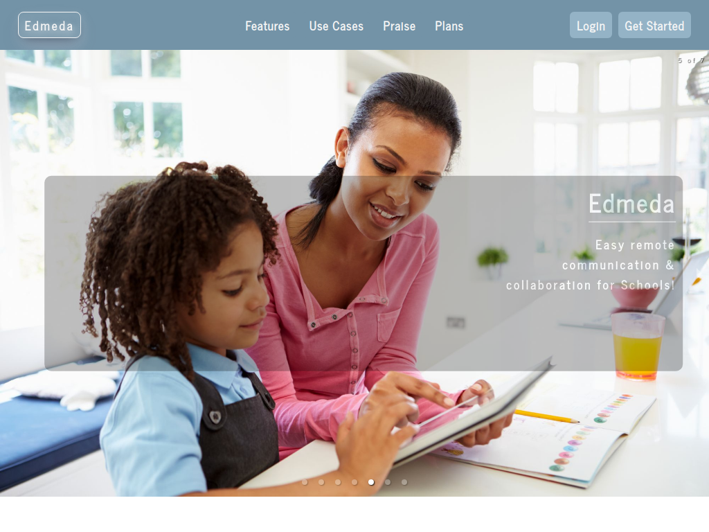

# Edmeda

**Easy remote communication & collaboration for Schools!**

## Edmeda Demo-Login

You can check out a [Demo of Edmeda](https://edmeda.herokuapp.com/) deployed on a free Heroku-Dyno, using the following credentials to login:

- E-Mail: **chuck@nerdherd.com**
- Password: **Chuck99**

## Motivation

Web-based remote communication & collaboration is an increasingly important subject, not only for companies, but also for Schools, especially in times of Covid-19, but also to teach team work and digital literacies.

With that in mind, Edmeda was created.

## What is Edmeda?

Edmeda is a password protected MERN-Stack Web Application which enables Schools to communicate & collaborate easily and effectively via multiple Communities. To achieve that, Teachers, Students and Parents alike are equipped with real-time Group Chats to share information instantaneously and effortlessly. Using Edmeda, Teachers can create limitless Communities - and inside those communities, a limitless number of user groups. Those Communities and their User Groups can be centered around any target audience or subject, thus enabling users to achieve a targeted communication and information exchange, even in times of Corona.

Edmeda is geared towards usability, so that all main tasks can be accomplished without leaving the current screen. Teachers have the ability to administer both communities and their users seamlessly right where it's needed, in the communities interface - without the need to dig through big and scary admin areas first, that tend to be apps of their own. The gender of newly registered Users is automatically recognized based on the first name - and User Avatars are assigned randomly based on user type and gender. Teachers can effortlessly create Communities of various types (e.g. Class-, Course- or Custom-Communities) and within those communities Student-, Parent and fellow Teacher-Accounts. By opening a community, they have access to its user groups and chats. Alongside default user groups, that are targeted to communicate with specific user types (e.g. students only, parents only, teachers only), each community can have an infinite number of custom user groups, that can be dedicated to arbitrary school subjects, projects, activities, events etc. - thus enabling the members to communicate and collaborate efficiently as a team!

## Awesome! I wanna use it for my School!

If you are interested in utilizing Edmeda for your School, just drop me an [E-Mail](mailto:christian.daum@protonmail.com?subject=[Edmeda]) detailing your needs - I'm happy to set Edmeda up for your School as a chance to test Edmeda "in the wild".

## Technology Key Facts

- Password-proteced MERN-Stack Web Application, deployed on Heroku (https://edmeda.herokuapp.com/)
- React-frontend & Express/Node.js-Backend, both encapsulated inside the same project
- DB-layer based on MongoDB (managed via MongoDB Atlas), ODM with Mongoose
- User Registration & User Authentication with JWT/Bycryptjs
- Realtime Group-Chats via WebSockets/Socket.io
- Package Management with npm
- React-packages: React Hook Form, React-Responsive, Axios, React-Toastify, React Icons, Gender Detection, etc. ...
